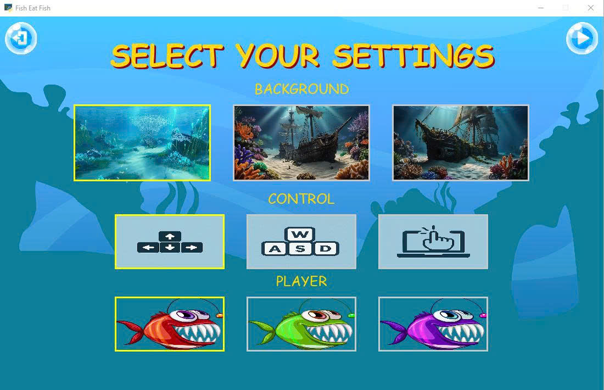

<!-- author: uncletientrung -->
# Đồ án môn Lập trình Java  
## Đề tài: Mô phỏng trò chơi Cá lớn nuốt cá bé bằng Python
### Thành viên nhóm
 Nguyễn Tiến Trung (L) - 3123410396  <br>
 Nguyễn Minh Thuận - 3123410365  <br>
 Phan Hoàng Vũ - 3123410436       <br>
 Nguyễn Phước Hòa Lâm - 3123410193 

## File báo cáo và slide PowerPoint nằm trong thư mục BaoCao
## Link chạy canva thuyết trình
    https://www.canva.com/design/DAGmxHrKwQg/Gh8c_tlZnxZBGoBDVIP4Wg/view?utm_content=DAGmxHrKwQg&utm_campaign=designshare&utm_medium=link2&utm_source=uniquelinks&utlId=h5c21c9e626#1

## Getting Started
1. Tải source code về:

    ```bash
   git clone https://github.com/uncletientrung/DoAn_Feeding_Frenzy.git
   ```

2. Mở xampp và vào trang http://localhost/phpmyadmin/ tạo 1 database mới có tên là feedingfrenzy và import cơ sở dữ liệu trong folder Database -> file feedingfrenzy.sql trong source code.

3. Sử dụng Visual Studio Code với môi trường 3.10.x (hoặc thấp hơn) để chạy source code.

4. Chạy code trong file Main.py

### Các đối tượng 

 
 
 <h4 align="center">Các đối tượng chính</h4>

 
 
 <h4 align="center">Các đối tượng khác</h4>

  
 
 <h4 align="center">Các đối tượng cá địch</h4>

### Giao diện
 
 
 <h4 align="center">Giao diện MENU GAME</h4>

  
 
 <h4 align="center">Giao diện giới thiệu</h4>

  
 
 <h4 align="center">Giao diện bảng xếp hạng</h4>

  
 
 <h4 align="center">Giao diện chọn nhân vật</h4>

  
 
 <h4 align="center">Giao diện chơi</h4>


 
 <h4 align="center">Giao diện GAMEOVER</h4>


 
 <h4 align="center">Giao diện dừng</h4>
 
 
